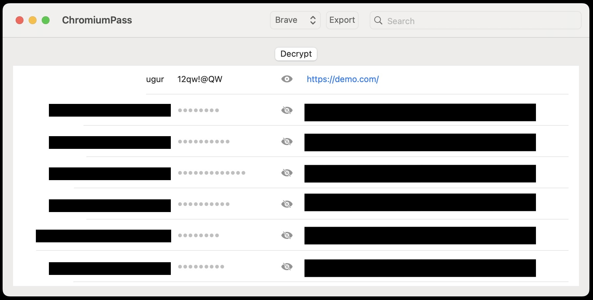

# ChromiumPass
Decrypt saved passwords of Chromium-based browsers.

## Requirements
- Xcode 15.3+
- Swift 5+
- macOS 14.1+

## Features
- Support Brave, Chrome, Opera and Custom files
- Auto detect Brave, Chrome and Opera saved passwords location and keychain.
- Export decrypted passwrods as csv file to Desktop. 

## Demo

## Disclaimer
This code is provided for educational purposes only; use it responsibly and within legal boundaries, ensuring all activities are authorized and ethical.
